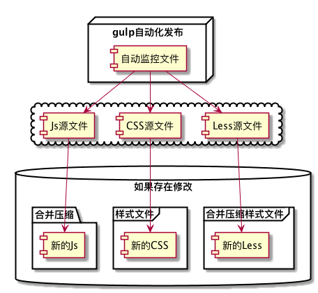

# 前端CSS/Js架构目录
####by lvyadong@hopperclouds.com since 2015-08-19.
```
用于聘宝前端CSS/Js架构
```

## 快速使用
```
#初始化环境
> npm install

＃查看temp目录内设计图，需要把设计图自己复制到temp内
> gulp gallery

＃页面开发预览
> gulp

＃页面发布
> npm deploy

#具体可参考gulpfile.js
```

## 自动化构建使用说明

目前前端自动化发布已经基本成型，前端所有源代码都保存在./frontend_dev目录内：
```
＃less文件：修改后自动生成对应CSS文件

＃CSS文件：修改后自动压缩并复制到发布目录

＃js文件：修改后自动压缩发布到对应发布目录，文件分两种angularjs库文件和普通js文件
```

## 使用方法（更详细使用可直接参考gulpfile.js）
```
#打开前端监控程序：
> gulp watch:Django (自动监控frontend_dev目录下less/css/js文件的修改，并发布)
> gulp watch:Django --src=yes (不压缩代码)
> gulp watch:Django --src=no (压缩代码)

＃gulp启动django服务器：
> gulp runserver:python


```

```
@startuml
node "gulp自动化发布" {
    [自动监控文件]
}
cloud {
    [自动监控文件] -> [Less源文件]
    [自动监控文件] -> [CSS源文件]
    [自动监控文件] -> [Js源文件]
}
database "如果存在修改" {
    folder "合并压缩" {
        [新的Js]
    }
    frame "合并压缩样式文件" {
        [新的Less]
    }

    frame "样式文件" {
        [新的CSS]
    }
}
[Less源文件] --> [新的Less]
[CSS源文件] --> [新的CSS]
[Js源文件] --> [新的Js]
@enduml
```


